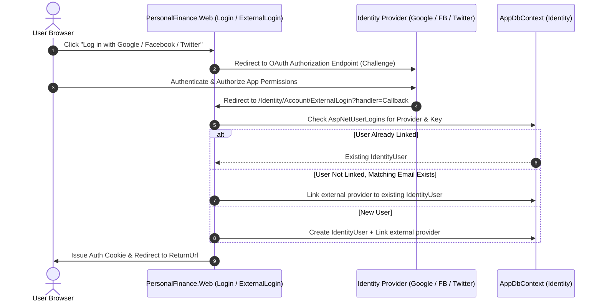

# Requirements

### Overview & Goals
Adding social sign-in (Google, Facebook, and Twitter/X) provides high overall utility by eliminating login friction, removing the need for users to remember separate passwords, and drastically reducing account creation abandonment. For the application, it leverages proven OAuth 2.0 / OpenID Connect identity providers to guarantee verified user identities and minimize password storage security risks.

### Scope
- **In Scope**:
  - Integration of Google, Facebook, and Twitter OAuth authentication schemes into ASP.NET Core Identity.
  - Safe credential management via `appsettings.json` and User Secrets.
  - Creation of `ExternalLogin.cshtml` and `ExternalLogin.cshtml.cs` Razor Pages to handle provider redirection, callback processing, automatic account creation, and account linking.
  - UI updates on `Login.cshtml` and `Register.cshtml` featuring branded provider buttons.
  - Automated tests validating scheme registration and external login handlers.
- **Out of Scope**:
  - Multi-factor authentication (MFA) enforcement on third-party provider accounts (delegated entirely to the provider).
  - Synchronizing third-party profile photos, feeds, or social graphs beyond identity and email claims.

### User Stories
- **As a user**, I want to sign in with my existing Google, Facebook, or Twitter account so that I can access my finances instantly without remembering another password.
- **As a new user**, I want to register using my social identity so that my email is pre-verified and I don't have to wait for manual email verification.
- **As an existing user**, I want my social login with a matching verified email to link smoothly with my account so that I can switch between password and social login seamlessly.

### Functional Requirements
1. **Provider Selection**: `Login.cshtml` and `Register.cshtml` must display active social sign-in buttons for Google, Facebook, and Twitter.
2. **OAuth Flow & Redirection**: Selecting a provider redirects the browser to the provider's authorization endpoint with required scopes (`openid`, `profile`, `email`).
3. **Callback Processing**:
   - If the external login is already associated with an existing `IdentityUser`, sign the user in and redirect to `ReturnUrl`.
   - If the user exists by email but the login is not yet linked, associate the external login with the existing account and sign the user in.
   - If no account exists, create an `IdentityUser` populated from the provider's email claim, mark `EmailConfirmed = true` (trusting provider verification), link the external login, and sign the user in.
   - If the provider does not supply an email, display the `ExternalLogin.cshtml` confirmation form allowing the user to provide an email address.
4. **Resilience & Missing Credentials**: In development or environments where certain provider keys are not yet configured, the system must degrade gracefully without crashing on startup.

### Non-Functional Requirements
- **Security**: Store client secrets outside version control (User Secrets / Environment Variables). Use state parameters and PKCE/cookie protection to prevent CSRF during OAuth handshakes.
- **Performance**: External redirection and callback handling must complete with zero perceptible overhead beyond network round-trips to the OAuth provider.
- **Accessibility**: Social login buttons must have distinct visual contrast, screen-reader accessible text, and keyboard navigation support.

# Technical Design

### Current Implementation
- **Framework & Identity**: `PersonalFinance.Web` is an ASP.NET Core application on .NET 10 using `Microsoft.AspNetCore.Identity` with `AppDbContext` (inheriting from `IdentityDbContext<IdentityUser>`).
- **Database**: The EF Core schema already contains `AspNetUserLogins` (`IdentityUserLogin<string>`), which tracks external provider keys (`LoginProvider`, `ProviderKey`, `UserId`).
- **UI**: `Login.cshtml` already checks `Model.ExternalLogins` and has an HTML form targeting `./ExternalLogin`, but `ExternalLogin.cshtml` and `ExternalLogin.cshtml.cs` are not yet created in `Areas/Identity/Pages/Account/`.

### Key Decisions
1. **Standard ASP.NET Core Authentication Handlers**: Use official packages `Microsoft.AspNetCore.Authentication.Google`, `Microsoft.AspNetCore.Authentication.Facebook`, and `Microsoft.AspNetCore.Authentication.Twitter` to minimize custom code and maximize reliability.
2. **Auto-Confirming OAuth Verified Emails**: Third-party providers verify ownership of email addresses. When provisioning a new user via OAuth, set `EmailConfirmed = true` directly to maximize user convenience and avoid duplicate confirmation email friction.
3. **Graceful Conditional Provider Registration**: Configure provider schemes conditionally or validate options so that missing API keys during local testing log a warning rather than failing application startup.

### Proposed Architecture & Flow



### File Structure & Changes
- `PersonalFinance/Directory.Packages.props`:
  - Add `Microsoft.AspNetCore.Authentication.Google`
  - Add `Microsoft.AspNetCore.Authentication.Facebook`
  - Add `Microsoft.AspNetCore.Authentication.Twitter`
- `PersonalFinance/src/PersonalFinance.Web/PersonalFinance.Web.csproj`:
  - Reference the three authentication packages.
- `PersonalFinance/src/PersonalFinance.Web/appsettings.json`:
  - Add `Authentication` configuration schema:
    ```json
    "Authentication": {
      "Google": { "ClientId": "", "ClientSecret": "" },
      "Facebook": { "AppId": "", "AppSecret": "" },
      "Twitter": { "ConsumerKey": "", "ConsumerSecret": "" }
    }
    ```
- `PersonalFinance/src/PersonalFinance.Web/Program.cs`:
  - Register `.AddGoogle()`, `.AddFacebook()`, and `.AddTwitter()` on `builder.Services.AddAuthentication()`.
- `PersonalFinance/src/PersonalFinance.Web/Areas/Identity/Pages/Account/ExternalLogin.cshtml` & `.cs`:
  - Implement external login initiation, callback handling, account creation, and user confirmation UI.
- `PersonalFinance/src/PersonalFinance.Web/Areas/Identity/Pages/Account/Login.cshtml` & `Register.cshtml`:
  - Enhance social login buttons with branded icons and styling.
- `PersonalFinance/tests/PersonalFinance.Tests/IdentityConfigurationTests.cs`:
  - Add tests validating external authentication scheme setup and user creation logic.

# Testing

### Validation Approach
Automated tests will verify the registration of authentication services, provider options configuration, and identity database linking without requiring active internet connection or live API credentials during CI runs.

### Key Scenarios
1. **Scheme Registration**: Verify that `IAuthenticationSchemeProvider` registers `Google`, `Facebook`, and `Twitter` schemes when configuration is supplied.
2. **Callback with Existing Linked Account**: Verify `ExternalLoginSignInAsync` finds the associated user and issues the authentication cookie.
3. **Callback with New Account**: Verify `UserManager.CreateAsync` and `UserManager.AddLoginAsync` create a verified user when given valid external claims.
4. **Account Linking by Email**: Verify an existing local user with matching email can have an external provider linked automatically.

### Edge Cases
- **Missing Email Claim**: When a provider does not supply an email address (e.g. certain Twitter configurations), verify that `ExternalLogin.cshtml` prompts the user for their email before finalizing registration.
- **Provider Authentication Denial**: Verify that if the user cancels or denies permission at the provider, the system redirects to `Login.cshtml` displaying an informative error message.
- **Duplicate Provider Link Attempt**: Verify handling when a provider key is already linked to another existing user.

### Test Changes
- Add unit tests in `PersonalFinance.Tests/IdentityConfigurationTests.cs` (or `ExternalAuthenticationTests.cs`) covering:
  - External authentication options registration.
  - `UserManager.AddLoginAsync` and `SignInManager.ExternalLoginSignInAsync` integration with in-memory SQLite `AppDbContext`.

# Delivery Steps

###   Step 1: Add OAuth Packages and Register External Authentication Providers
Add required OAuth authentication packages and configure social authentication schemes in the dependency injection container.

- Add `Microsoft.AspNetCore.Authentication.Google`, `Microsoft.AspNetCore.Authentication.Facebook`, and `Microsoft.AspNetCore.Authentication.Twitter` package versions to `Directory.Packages.props` and reference them in `PersonalFinance.Web.csproj`.
- Update `appsettings.json` with configuration sections for `Authentication:Google`, `Authentication:Facebook`, and `Authentication:Twitter` (ClientId/AppId and ClientSecrets).
- Update `Program.cs` in `PersonalFinance.Web` to register the external authentication providers using `builder.Services.AddAuthentication().AddGoogle().AddFacebook().AddTwitter()` with graceful fallbacks when credentials are unconfigured in development.

###   Step 2: Implement ExternalLogin Razor Page and Account Linking Workflow
Implement the external authentication callback handler to process third-party tokens, create or link user accounts, and manage session cookies.

- Create `ExternalLogin.cshtml` and `ExternalLogin.cshtml.cs` in `PersonalFinance.Web/Areas/Identity/Pages/Account/`.
- Implement `OnPost` handler to issue the challenge redirect to the selected OAuth provider with return URL.
- Implement `OnGetCallbackAsync` handler to process external login info via `SignInManager.GetExternalLoginInfoAsync()`.
- Handle existing user login via `SignInManager.ExternalLoginSignInAsync()`.
- Handle new user provisioning: extract email and profile claims, create `IdentityUser`, associate external login via `UserManager.AddLoginAsync()`, mark email as confirmed for verified OAuth providers, and sign the user in.
- Handle error and confirmation states when email claim is missing or requires manual user confirmation.

###   Step 3: Enhance Social Authentication UI on Login and Register Pages
Update the login and registration interfaces to provide clear, branded social login options for users.

- Update `Login.cshtml` to render styled, brand-consistent buttons for Google, Facebook, and Twitter (X) with distinct icons and colors.
- Update `Register.cshtml` to include the external provider section so new users can register immediately via their social accounts.
- Ensure responsive styling and accessible ARIA attributes for all social login buttons.

###   Step 4: Add Unit and Integration Tests for Social Authentication
Verify OAuth handler registration, configuration loading, and account provisioning logic through automated tests.

- Add unit and configuration tests in `PersonalFinance.Tests/IdentityConfigurationTests.cs` (or a dedicated `ExternalAuthenticationTests.cs`) verifying that Google, Facebook, and Twitter authentication schemes are correctly registered.
- Add unit tests for `ExternalLoginModel` to validate claim extraction, account creation, external login association, and error handling flows.
- Verify test suite passes with `dotnet test`.