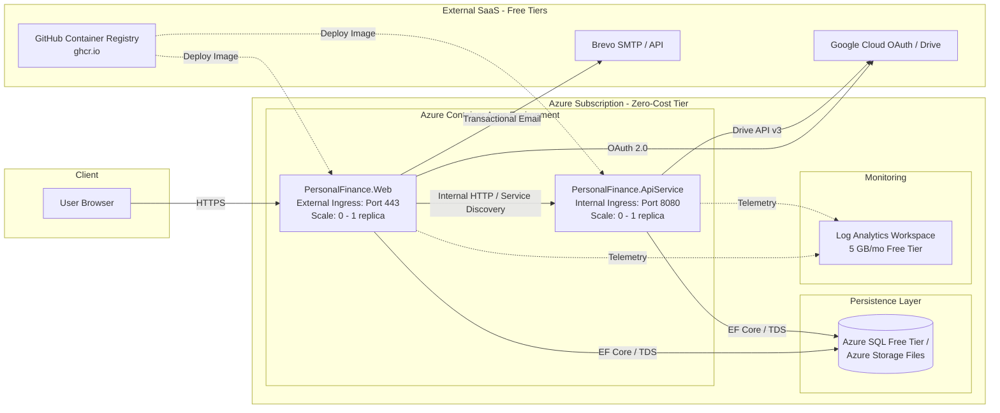

# Requirements

### Overview & Goals
The objective is to deploy the **Personal Finance App** (.NET 10 solution comprising `PersonalFinance.AppHost`, `PersonalFinance.Web`, `PersonalFinance.ApiService`, and `PersonalFinance.Data`) to Microsoft Azure with the **absolute lowest possible operating cost** (targeting **$0.00 to <$2.00 / month**), while preserving architectural best practices, high security, automated CI/CD, and scalability.

---

### Cost Optimization Strategy & Azure Budget Breakdown

| Service / Resource | Azure Tier / SKU | Monthly Allocation / Free Grant | Estimated Monthly Cost |
|---|---|---|---|
| **Compute: Web App** | Azure Container Apps (ACA) Consumption | 180,000 vCPU-seconds + 360,000 GiB-s + 2M requests / month **FREE** | **$0.00** (scale-to-zero when idle) |
| **Compute: API Backend** | Azure Container Apps (ACA) Consumption | Shared free quota with internal-only ingress | **$0.00** (scale-to-zero when idle) |
| **Database** | Azure SQL Database Free Tier (Serverless) *or* SQLite on Azure Files | 100,000 vCore seconds + 32 GB free lifetime *or* Azure Files Standard LRS | **$0.00** (Azure SQL Free) *or* **~$0.05 - $0.20** (Azure Files) |
| **Container Registry** | GitHub Container Registry (`ghcr.io`) | 500 MB storage & unlimited public / generous private transfers | **$0.00** (replaces $5/mo Azure Container Registry) |
| **Secrets & Keys** | Azure Container Apps Native Secrets *or* Key Vault (Standard) | 10,000 transactions free / native ACA encrypted storage | **$0.00** |
| **Telemetry & Logs** | Azure Log Analytics + App Insights | 5 GB data ingestion / month **FREE** | **$0.00** |
| **Email Delivery** | Brevo (Sendinblue) Free Tier | 300 transactional emails / day **FREE** | **$0.00** |
| **OAuth & APIs** | Google Cloud Console OAuth 2.0 & Drive API | Standard free tiers for user authentication and drive v3 calls | **$0.00** |
| **Total Estimated Azure Cost** | | | **$0.00 – $0.20 / month** |

---

### Scope
- **In Scope**:
  - Containerization of `PersonalFinance.Web` and `PersonalFinance.ApiService` for Linux x64 with .NET 10.
  - Zero-cost infrastructure provisioning using Bicep Infrastructure-as-Code (IaC).
  - Azure Container Apps (ACA) environment deployment with internal service discovery.
  - Database persistence strategy (Azure SQL Free Tier or Azure Files mounted SQLite).
  - Production configuration and secrets management for Google OAuth, Brevo Email, and Google Drive API.
  - Automated GitHub Actions CI/CD pipeline using GitHub Container Registry (`ghcr.io`) and OIDC passwordless Azure authentication.
- **Out of Scope**:
  - Provisioning costly enterprise services (Azure App Gateway, Front Door, Redis Enterprise, Premium Container Apps).
  - Multi-region geo-replication (not required for personal finance workload).

---

### User Stories
- **As a Developer/Owner**, I want to deploy my .NET 10 solution to Azure at near-zero cost so that I can host my personal finance application without recurring cloud expenses.
- **As an End User**, I want to access the web application securely over HTTPS with Google OAuth and email confirmations working reliably.
- **As an Operator**, I want continuous deployment from Git commits with automated testing and zero manual infrastructure management.

# Technical Design

### Current Implementation Context
- **Solution Composition**:
  - `PersonalFinance.Web`: ASP.NET Core MVC + Razor Pages + Identity UI, calling `PersonalFinance.ApiService` via Refit HTTP client.
  - `PersonalFinance.ApiService`: ASP.NET Core REST API with Scalar OpenAPI UI and Google Drive integrations.
  - `PersonalFinance.Data`: EF Core DbContext with SQLite (`PersonalFinance.db`), ASP.NET Core Identity tables, and Google Drive cached connections. Already references `Microsoft.EntityFrameworkCore.SqlServer` and `Microsoft.EntityFrameworkCore.Sqlite`.
  - `PersonalFinance.ServiceDefaults`: Aspire telemetry, health checks (`/health`, `/alive`), and HTTP resilience.

---

### Architecture & Resource Selection Matrix



---

### Key Architectural Decisions

#### Decision 1: Azure Container Apps (ACA) Consumption vs. Azure App Service
- **Chosen**: Azure Container Apps (ACA) Consumption Profile.
- **Rationale**: 
  - Standard App Service B1 costs ~$13/month. App Service Free (F1) has severe 60-min/day CPU quotas and lacks custom domain SSL and microservice networking.
  - ACA Consumption provides **180,000 vCPU-seconds + 360,000 GiB-seconds free every month**, scales to zero when unvisited, supports microservice DNS resolution (`http://apiservice`), and offers built-in managed TLS.

#### Decision 2: Database Strategy — Azure SQL Database Free Tier vs. SQLite on Azure Files
- **Recommended Option**: **Azure SQL Database Lifetime Free Tier** (Serverless, General Purpose, 32 GB storage, 100,000 vCore seconds/mo).
  - *Rationale*: Microsoft grants one free Azure SQL Database per subscription. It eliminates file lock issues with SQLite across microservices (`Web` and `ApiService` both querying `AppDbContext`), provides automatic backups, and `Directory.Packages.props` already includes `Microsoft.EntityFrameworkCore.SqlServer`.
- **Alternative Option**: **SQLite on Azure Files Share ($0.05/mo)**.
  - Persistent volume mounted to `/app/data/PersonalFinance.db`. Set `maxReplicas: 1` to prevent write locking.

#### Decision 3: Container Registry — GitHub Container Registry (`ghcr.io`) vs. Azure Container Registry (ACR)
- **Chosen**: GitHub Container Registry (`ghcr.io`).
- **Rationale**: ACR Basic costs ~$5.00/month. GHCR is 100% free for public and private repositories under standard developer tier, reducing Azure fixed cost to $0.00.

---

### Infrastructure as Code (Bicep) Structure

```
infra/
├── main.bicep                  # Orchestrates ACA Environment, Log Analytics, Database, and Container Apps
├── main.parameters.json        # Parameter mapping for environment
├── modules/
│   ├── log-analytics.bicep     # Free 5GB/mo workspace
│   ├── container-env.bicep     # Container Apps Managed Environment
│   ├── sql-database.bicep      # Azure SQL Serverless Free Tier
│   ├── api-service.bicep       # ApiService Container App (Internal ingress)
│   └── web-service.bicep       # Web App Container App (External ingress)
└── deploy.ps1                  # Single-command local deployment script
```

---

### Key Configuration & Secrets Mapping

| Configuration Key | Source in Azure | Purpose |
|---|---|---|
| `ConnectionStrings:DefaultConnection` | Bicep / ACA Secret | Connection string to Azure SQL Serverless or SQLite mount |
| `Authentication:Google:ClientId` | ACA Secret / GitHub Secrets | OAuth 2.0 Web Client ID from Google Cloud Console |
| `Authentication:Google:ClientSecret` | ACA Secret / GitHub Secrets | OAuth 2.0 Client Secret |
| `Brevo:ApiKey` | ACA Secret / GitHub Secrets | Brevo REST API key for transactional emails |
| `Brevo:SenderEmail` | Environment Variable | Verified sender email |
| `services__apiservice__http__0` | ACA Environment Discovery | Aspire Service Discovery URL (`http://apiservice`) |

---

### Implementation File Structure Additions

```
PersonalFinanceApp/
├── .github/
│   └── workflows/
│       └── deploy-azure.yml             # GitHub Actions CI/CD to GHCR & Azure ACA
├── infra/
│   ├── main.bicep                      # Root IaC template
│   └── modules/                        # Modular Bicep components
├── PersonalFinance/
│   ├── src/
│   │   ├── PersonalFinance.ApiService/
│   │   │   └── Dockerfile              # Multi-stage production Dockerfile (.NET 10)
│   │   └── PersonalFinance.Web/
│   │       └── Dockerfile              # Multi-stage production Dockerfile (.NET 10)
│   └── Directory.Packages.props
└── DEVELOPMENT.md                      # Updated with Azure deployment workflows
```

# Testing

### Validation Approach
Verification is performed across three dimensions: infrastructure validity, container runtime integrity, and zero-cost billing adherence.

---

### Key Validation Scenarios

1. **Bicep Template & Dry-Run Validation**:
   - Run `az bicep build --file infra/main.bicep` to verify syntax.
   - Run `az deployment sub what-if --template-file infra/main.bicep` to inspect planned resources prior to provisioning.

2. **Local Multi-Container Test**:
   - Build containers locally using `docker build -t personalfinance-api:local -f PersonalFinance/src/PersonalFinance.ApiService/Dockerfile .` and `docker build -t personalfinance-web:local -f PersonalFinance/src/PersonalFinance.Web/Dockerfile .`.
   - Verify health check endpoints (`/health`, `/alive`) return HTTP 200 OK.

3. **End-to-End Cloud Verification**:
   - Access Web URL: `https://<web-app-name>.<region>.azurecontainerapps.io/`.
   - Verify Google OAuth redirects and callbacks to `/signin-google`.
   - Verify transactional email dispatch via Brevo upon registration.
   - Verify Web consumes ApiService endpoints via internal DNS resolution (`http://apiservice/items`).

4. **Cost & Quota Monitoring**:
   - Configure Azure Cost Management Budget alert at **$1.00 USD/month** threshold to guarantee no unexpected charges.
   - Verify Azure SQL Database is provisioned with `FreeLimitExhaustionBehavior: AutoPause`.
   - Verify Container Apps scale down to 0 replicas during inactivity.

# Delivery Steps

### ✓ Step 1: Containerization and Multi-Project Container Configuration
Production-ready, multi-stage Dockerfiles and container configurations are in place for both Web and ApiService projects.

- Create multi-stage `Dockerfile` for `PersonalFinance.ApiService` targeting .NET 10 ASP.NET runtime with chiseled/distroless non-root security.
- Create multi-stage `Dockerfile` for `PersonalFinance.Web` targeting .NET 10 ASP.NET runtime.
- Update `Directory.Packages.props` and project files to ensure container optimization, trimming, and release-ready build properties.
- Add `.dockerignore` to exclude local SQLite database files, bin/obj folders, and local user secrets.
- Verify container builds and startup locally using Docker CLI or Aspire container publishing.

### ✓ Step 2: Infrastructure as Code (IaC) & Azure Container Apps Environment Setup
Modular Bicep templates and deployment scripts are established to provision the lowest-cost Azure architecture.

- Define `main.bicep` orchestrating resource groups, Log Analytics Workspace (Free 5GB/mo tier), and Azure Container Apps Environment with Workload Profiles.
- Define `apiservice.bicep` configuring internal-only ingress, HTTP health probes (`/health`, `/alive`), and scale-to-zero autoscaling rules (0 to 1 replica).
- Define `web.bicep` configuring external HTTPS ingress, custom domain bindings, and environment variables referencing the internal ApiService.
- Configure Azure Key Vault or ACA Container Secrets integration for `Brevo:ApiKey`, `Authentication:Google:ClientId`, `Authentication:Google:ClientSecret`, and `GoogleDrive:ApiKey`.
- Add local validation script `deploy.bicep.ps1` / `azd` configuration to validate Bicep templates against Azure CLI.

### ✓ Step 3: Database Persistence and Automated EF Core Migration Pipeline
Cost-free or ultra-low-cost database persistence and automated schema migration are configured.

- Configure Azure SQL Database Lifetime Free Tier (32GB free storage, Serverless auto-pause) or Azure Files persistent volume mount for SQLite (`PersonalFinance.db`).
- Update `AppDbContextFactory` and runtime configuration in `PersonalFinance.Data` to support environment-driven database provider switching (SQLite / SQL Server).
- Implement an automated migration runner in container startup or via an initialization job (ACA Job) to execute EF Core migrations safely without downtime.
- Verify seeding logic and initial items data persistence across container restarts.

### ✓ Step 4: CI/CD Pipeline with GitHub Actions and Zero-Cost Registry
An automated GitHub Actions workflow builds containers, pushes images to GitHub Container Registry (GHCR), and deploys updates to Azure without incurring container registry costs.

- Create `.github/workflows/deploy-azure.yml` triggered on push to `main` branch.
- Configure GitHub Container Registry (`ghcr.io`) authentication to eliminate Azure Container Registry (ACR) monthly fees.
- Configure OpenID Connect (OIDC) federated credentials with Azure Managed Identity for passwordless CI/CD deployments.
- Add build, test (`dotnet test PersonalFinance.sln`), container build, and Bicep deployment steps in the workflow.
- Execute end-to-end smoke tests against deployed endpoints (`/`, `/health`, `/scalar/v1`, `/Identity/Account/Login`).