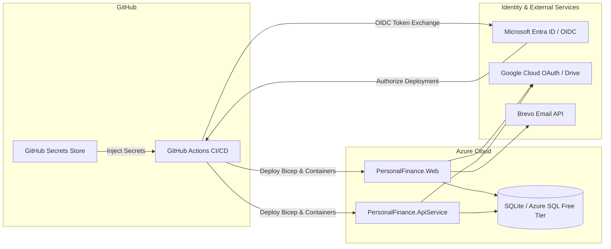

# Requirements

### Overview & Goals
The goal is to provide a complete, deterministic, and secure procedure for obtaining, configuring, and verifying all required and optional external credentials needed to deploy the **Personal Finance** application to Microsoft Azure Container Apps via GitHub Actions CI/CD or local CLI tooling.

### Scope
- **In Scope**:
  - Step-by-step guidance for obtaining Azure OIDC credentials (`AZURE_CLIENT_ID`, `AZURE_TENANT_ID`, `AZURE_SUBSCRIPTION_ID`).
  - Step-by-step setup for Google OAuth 2.0 and Google Drive API v3 credentials.
  - Step-by-step setup for Brevo transactional email credentials.
  - Configuration of GitHub Actions Repository Secrets.
  - Verification and execution of the automated CI/CD deployment pipeline (`.github/workflows/deploy-azure.yml`).
- **Out of Scope**:
  - Purchasing custom domains (covered optionally in `deployment.md`).
  - Modifying application source code or Bicep infrastructure templates.

### User Stories
- **As a Developer/DevOps Engineer**, I want to configure passwordless OIDC authentication between GitHub Actions and Microsoft Entra ID so that my CI/CD deployment runs securely without long-lived secret rotation overhead.
- **As a System Administrator**, I want step-by-step instructions to obtain external API keys (Google OAuth, Google Drive, Brevo) so that identity and email services work seamlessly after deployment.

### Functional Requirements
- Gather and record exact Azure Subscription, Tenant, and Client identifiers.
- Configure Microsoft Entra ID App Registration with Federated Credentials mapped to the GitHub repository branch (`main`).
- Assign `Contributor` role in Azure IAM to the App Registration.
- Obtain Google OAuth Client ID & Secret for ASP.NET Core Identity external authentication.
- Obtain Google Drive API Key for ApiService backend integration.
- Generate Brevo v3 REST API Key and verify sender email for transactional emails.
- Store all credentials as GitHub Secrets and execute automated workflow validation.

# Technical Design

### Current Implementation
The application uses an automated GitHub Actions CI/CD pipeline (`.github/workflows/deploy-azure.yml`) and Bicep infrastructure modules (`infra/main.bicep`) targeting Azure Container Apps Consumption profile:
- **`PersonalFinance.Web`**: Consumes `Authentication__Google__ClientId`, `Authentication__Google__ClientSecret`, and `Brevo__ApiKey`.
- **`PersonalFinance.ApiService`**: Consumes `GoogleDrive__ApiKey`.
- **Deployment Pipeline**: Authenticates via `azure/login@v2` using passwordless OIDC federated tokens (`AZURE_CLIENT_ID`, `AZURE_TENANT_ID`, `AZURE_SUBSCRIPTION_ID`).

### Key Decisions
1. **Passwordless Azure Authentication (OIDC)**: Use Microsoft Entra ID Federated Credentials instead of client secrets or service principal passwords. This maximizes security and eliminates credential expiration issues.
2. **Modular Credential Configuration**: Optional services (Google OAuth, Google Drive, Brevo) can remain empty if not needed; the application gracefully disables those integrations if the keys are absent.
3. **Automated Smoke Testing**: Post-deployment workflow validates container health and readiness via `infra/smoke-test.ps1`.

### Secrets & Parameters Reference Matrix
| Secret Name | GitHub Secret Key | Bicep Parameter | Required? | Source |
|---|---|---|---|---|
| **Azure Client ID** | `AZURE_CLIENT_ID` | N/A (OIDC) | Yes | Azure App Registration Application (client) ID |
| **Azure Tenant ID** | `AZURE_TENANT_ID` | N/A (OIDC) | Yes | Microsoft Entra ID Directory (tenant) ID |
| **Azure Subscription ID** | `AZURE_SUBSCRIPTION_ID` | `subscriptionId` | Yes | Azure Portal Subscriptions blade |
| **Google OAuth Client ID** | `GOOGLE_CLIENT_ID` | `googleClientId` | Optional | Google Cloud Console OAuth 2.0 Web Client |
| **Google OAuth Client Secret**| `GOOGLE_CLIENT_SECRET` | `googleClientSecret`| Optional | Google Cloud Console OAuth 2.0 Web Client |
| **Google Drive API Key** | `GOOGLE_DRIVE_API_KEY` | `googleDriveApiKey` | Optional | Google Cloud Console API Keys (Drive API v3 enabled) |
| **Brevo REST API Key** | `BREVO_API_KEY` | `brevoApiKey` | Optional | Brevo Dashboard SMTP & API Keys |
| **Custom Connection String** | `CUSTOM_CONNECTION_STRING` | `customConnectionString` | Optional | External SQL Server / Azure SQL connection string |

### Architecture Diagram

# Testing

### Validation Approach
Verification is performed via the automated GitHub Actions pipeline and post-deployment smoke tests.

### Key Scenarios
1. **OIDC Authentication Handshake**:
   - Verify that the `deploy-azure` job successfully executes `azure/login@v2` without throwing `AADSTS70021` (Federated identity mismatch).
2. **Bicep Template Deployment**:
   - Verify that `azure/arm-deploy@v2` deploys all container apps and environment resources to `rg-personalfinance-prod` without permission errors.
3. **Application Health Probes**:
   - Verify that the deployed web endpoint responds with HTTP `200 OK` on `/health` and `/alive`.
4. **Identity & Social Sign-In (if configured)**:
   - Navigate to `/Identity/Account/Login` and confirm Google button is rendered and initiates OAuth flow with correct redirect URI.
5. **Transactional Email (if configured)**:
   - Register a new account and verify that confirmation email is sent via Brevo API without HTTP 401.

# Delivery Steps

### ✓ Step 1: Stage 1: Provision Azure Entra ID App Registration and OIDC Federated Identity
Microsoft Azure Subscription ID, Tenant ID, and OIDC App Registration Client ID are gathered, federated credentials for GitHub Actions are configured, and IAM Contributor permissions are granted.

- Retrieve Subscription ID from Azure Portal Subscriptions blade or Azure CLI (`az account show`).
- Retrieve Microsoft Entra ID Tenant ID from Microsoft Entra ID Overview.
- Create an App Registration named `personalfinance-github-actions` in Microsoft Entra ID and record its Application (Client) ID.
- Create a Federated Credential in the App Registration for the GitHub repository `main` branch to enable passwordless OIDC authentication.
- Assign the `Contributor` role to the App Registration at the Subscription scope (or target Resource Group `rg-personalfinance-prod`).

### ✓ Step 2: Stage 2: Configure Google Cloud OAuth and Google Drive API Credentials
Google OAuth 2.0 Web Client and API keys are created and configured in Google Cloud Console.

- Create or select a Google Cloud Project in Google Cloud Console.
- Configure the OAuth Consent Screen (App Name, User Support Email, Developer Contact).
- Create OAuth 2.0 Web Client credentials with authorized redirect URI `/signin-google` and capture Client ID and Client Secret.
- Enable Google Drive API v3 in API Library and create a restricted API key for `GOOGLE_DRIVE_API_KEY`.

### ✓ Step 3: Stage 3: Generate Brevo Transactional Email API Key
Brevo v3 REST API key is generated and sender email address is verified.

- Log in to the Brevo Dashboard and navigate to SMTP & API settings.
- Generate a new v3 API key named `PersonalFinance-Prod` and save the secret value.
- Verify the sender email address under Brevo Senders & Domains to ensure successful delivery of account confirmation emails.

### ✓ Step 4: Stage 4: Configure GitHub Secrets and Trigger Automated CI/CD Deployment
All deployment credentials are saved in GitHub Repository Secrets and the deployment pipeline runs successfully.

- Navigate to GitHub Repository `Settings` -> `Secrets and variables` -> `Actions`.
- Add `AZURE_CLIENT_ID`, `AZURE_TENANT_ID`, `AZURE_SUBSCRIPTION_ID`, `GOOGLE_CLIENT_ID`, `GOOGLE_CLIENT_SECRET`, `GOOGLE_DRIVE_API_KEY`, and `BREVO_API_KEY`.
- Trigger the `Build, Test, and Deploy to Azure Container Apps` workflow from the Actions tab or push to `main` branch.
- Validate that the deployment succeeds and post-deployment smoke tests pass against `/health` and `/alive`.