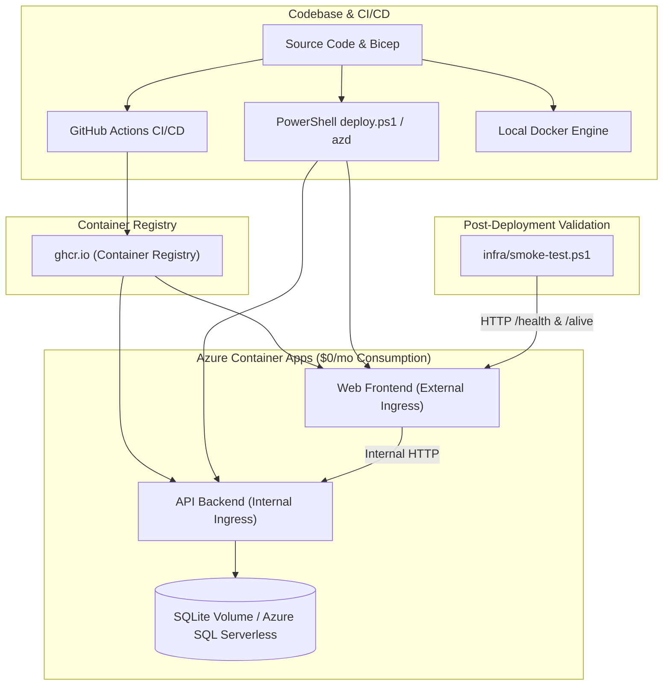

# Requirements

### Overview & Goals
The goal is to produce a comprehensive, structured, step-by-step deployment guide named `deployment.md` in the project root. The document will maximize utility and clarity, providing deterministic, copy-pasteable instructions for operators and developers deploying the PersonalFinance application across all supported modalities.

### Scope
- **In Scope**:
  - Creation of `deployment.md` in the root repository directory.
  - Clear prerequisite matrix (tools, accounts, API keys, credentials).
  - Detailed steps for 4 primary deployment avenues:
    1. Automated CI/CD via GitHub Actions (`.github/workflows/deploy-azure.yml`) with Azure OIDC and GitHub Container Registry (`ghcr.io`).
    2. Local CLI deployment to Azure via PowerShell (`infra/deploy.ps1`) with Bicep validation (`-ValidateOnly`, `-WhatIf`).
    3. Azure Developer CLI (`azd up`) deployment using `azure.yaml`.
    4. Local containerized execution via Docker (`Dockerfile`).
  - Step-by-step verification procedures using `infra/smoke-test.ps1`.
  - Common troubleshooting and diagnostics runbook (OIDC, database migrations, CORS/routing, Brevo email delivery).
- **Out of Scope**:
  - Modifying existing application source code, Dockerfiles, or Bicep infrastructure templates.

### User Stories
- *As a developer or DevOps engineer*, I want a step-by-step guide in `deployment.md` so that I can deploy the PersonalFinance stack to Azure Container Apps reliably with zero guesswork.
- *As a project contributor*, I want clear guidance on local Docker execution and smoke testing so that I can validate deployment readiness before pushing changes.

### Functional Requirements
- **Prerequisites & Credentials Checklist**: Table summarizing required tools (`az`, `bicep`, `docker`, `azd`), required Azure permissions, and external service keys (Google OAuth, Brevo, Google Drive).
- **GitHub Actions Deployment Guide**: Step-by-step repository secret configuration and execution triggers.
- **PowerShell / CLI Deployment Guide**: Clear command recipes for dry-runs, parameter overrides (custom SQL Serverless, domain, secrets), and execution.
- **Docker Local Guide**: Step-by-step multi-stage container build commands and multi-container runtime execution.
- **Verification & Smoke Testing**: Exact commands to run `infra/smoke-test.ps1` and verify health/readiness probes (`/health`, `/alive`).
- **Operational Diagnostics**: Clear troubleshooting entries with symptoms, causes, and actionable remediations.

### Non-Functional Requirements
- **Utilitarian Clarity**: Clear hierarchy, copy-pasteable code blocks with parameter placeholders, and concise explanations focused on operator efficiency.
- **Accuracy**: Exact alignment with existing repo scripts (`infra/deploy.ps1`, `infra/smoke-test.ps1`, `infra/main.bicep`, `azure.yaml`).

# Technical Design

### Current Implementation
The repository contains a fully automated zero-cost Azure Container Apps (ACA) infrastructure:
- **Bicep Infrastructure**: `infra/main.bicep`, `infra/modules/` defining Container Apps Environment, Log Analytics, API service (internal ingress), Web service (external ingress), and optional Azure SQL Database Serverless Free Tier.
- **Automation Scripts**: `infra/deploy.ps1` for PowerShell/Azure CLI deployments; `infra/smoke-test.ps1` for automated HTTP verification.
- **CI/CD Workflow**: `.github/workflows/deploy-azure.yml` with .NET 10 test suite, GHCR multi-stage image build, Bicep validation, OIDC login, and automated rollout.
- **Developer CLI**: `azure.yaml` configured for `azd up`.
- **Docker**: `PersonalFinance/src/PersonalFinance.ApiService/Dockerfile` and `PersonalFinance/src/PersonalFinance.Web/Dockerfile`.

### Key Decisions
- **Single Source of Truth (`deployment.md`)**: Consolidate all deployment options into one well-indexed markdown file at the repository root.
- **Structured Selection Guide**: Group workflows by use case (Recommended CI/CD, Local Terminal / PowerShell, `azd`, Local Docker) so operators immediately find the most efficient path.
- **Prescriptive Environment Secrets**: Explicitly tabulate all required and optional environment variables and secrets to prevent deployment failures.

### Document Architecture & Outline
The generated `deployment.md` will follow this structure:
1. **Architecture & Deployment Strategy Overview** (Zero-cost scale-to-zero ACA architecture summary).
2. **Prerequisites & Secrets Matrix** (Tools, CLI versions, Azure OIDC, Google OAuth, Brevo).
3. **Deployment Method 1: GitHub Actions CI/CD (Recommended)** (Secrets setup, workflow triggers, branch automation).
4. **Deployment Method 2: Local PowerShell / Azure CLI (`infra/deploy.ps1`)** (Validation, What-If preview, full provisioning with parameters).
5. **Deployment Method 3: Azure Developer CLI (`azd`)** (Login, environment initialization, provisioning).
6. **Deployment Method 4: Local Multi-Container Docker** (Build commands, container execution, network mapping).
7. **Post-Deployment Smoke Testing & Health Checks** (`infra/smoke-test.ps1`, `/health`, `/alive`, `/scalar/v1`).
8. **Operational Troubleshooting & FAQs** (Common failure scenarios and resolutions).

### Architecture Diagram

### Components & Affected Files
- **New File**: `C:\workdir\repos\PersonalFinanceApp\deployment.md`
- **Referenced Components**:
  - `infra/deploy.ps1`
  - `infra/smoke-test.ps1`
  - `infra/main.bicep`
  - `.github/workflows/deploy-azure.yml`
  - `azure.yaml`
  - `PersonalFinance/src/PersonalFinance.ApiService/Dockerfile`
  - `PersonalFinance/src/PersonalFinance.Web/Dockerfile`

# Delivery Steps

### ✓ Step 1: Draft prerequisites, secrets matrix, and GitHub Actions CI/CD deployment guide in deployment.md
Initializes `deployment.md` with structured prerequisite checklists and step-by-step instructions for continuous deployment via GitHub Actions.

- Create `deployment.md` with clear section headers, executive summary, and deployment pathway selection matrix.
- Specify prerequisites: Azure subscription, GitHub repository permissions, Google OAuth credentials, and Brevo API credentials.
- Document configuration of GitHub Secrets (`AZURE_CLIENT_ID`, `AZURE_TENANT_ID`, `AZURE_SUBSCRIPTION_ID`, `GOOGLE_CLIENT_ID`, `GOOGLE_CLIENT_SECRET`, `BREVO_API_KEY`, `GOOGLE_DRIVE_API_KEY`).
- Provide step-by-step guide to trigger `.github/workflows/deploy-azure.yml` via automatic branch push and manual `workflow_dispatch`.

### ✓ Step 2: Document CLI-driven Azure deployments (deploy.ps1 & azd) and local Docker execution
Enriches `deployment.md` with full step-by-step CLI deployment guides for Azure and local Docker environments.

- Document the PowerShell deployment script (`infra/deploy.ps1`) workflow, including parameter tables, dry-run validation (`-ValidateOnly`), change preview (`-WhatIf`), and execution examples.
- Document the Azure Developer CLI (`azd auth login` and `azd up`) workflow utilizing `azure.yaml`.
- Provide exact multi-stage Docker build and run commands for local container execution (`PersonalFinance.ApiService` on port 8081, `PersonalFinance.Web` on port 8080).

### ✓ Step 3: Add post-deployment smoke testing, health validation, and troubleshooting runbook
Finalizes `deployment.md` with automated verification runbooks, health endpoint checks, and diagnostic troubleshooting steps.

- Provide instructions for running automated smoke tests with `infra/smoke-test.ps1` against the public web URL.
- Document manual verification steps for `/health`, `/alive`, `/Identity/Account/Login`, and internal `/scalar/v1` API documentation.
- Add operational troubleshooting tables for common failure modes (Azure OIDC role assignments, container cold-start readiness timeouts, database migration errors, and Brevo transactional email delivery issues).