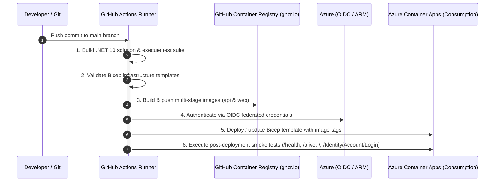

# Personal Finance App - Development Notes & Developer Guide

This document provides developer guidelines, architectural details, configuration instructions, secrets management workflows, and troubleshooting solutions for developing and maintaining the **Personal Finance App**.

---

## 1. Prerequisites & Environment Setup

### Required SDKs and Tools
- **.NET 10 SDK** (v10.0.100 preview or higher)
- **Entity Framework Core CLI Tools (`dotnet-ef`)**:
  ```bash
  dotnet tool install --global dotnet-ef
  # Or update if already installed
  dotnet tool update --global dotnet-ef
  ```
- **ASP.NET Core Code Generator (`dotnet-aspnet-codegenerator`)** *(for scaffolding Identity pages)*:
  ```bash
  dotnet tool install --global dotnet-aspnet-codegenerator
  # Or update if already installed
  dotnet tool update --global dotnet-aspnet-codegenerator
  ```
- **IDE**: JetBrains Rider (recommended), Visual Studio 2022+ / 2026+, or VS Code with C# Dev Kit.
- **Git**

---

## 2. Solution Structure & Project Architecture

The solution uses a Clean Architecture pattern integrated with **.NET Aspire**:

```
PersonalFinanceApp/
├── PersonalFinance.sln                      # Solution configuration
├── PersonalFinance.db                       # Shared SQLite database (git-ignored)
├── CHANGELOG.md                             # Release changelog
├── DEVELOPMENT.md                           # Developer guidelines (this document)
├── README.md                                # General project documentation
└── PersonalFinance/
    ├── src/
    │   ├── PersonalFinance.AppHost/         # .NET Aspire orchestrator & dashboard
    │   ├── PersonalFinance.ServiceDefaults/ # Aspire telemetry, health checks & resilience
    │   ├── PersonalFinance.Web/             # ASP.NET Core MVC, Razor Pages, Identity UI
    │   ├── PersonalFinance.ApiService/      # REST API backend, Google Drive service & Scalar
    │   ├── PersonalFinance.Data/            # EF Core AppDbContext, entities & migrations
    │   └── PersonalFinance.Shared/          # Contracts, DTOs, helpers & cryptographic utilities
    └── tests/
        └── PersonalFinance.Tests/           # xUnit unit and integration tests
```

### Architectural Roles

| Project | Responsibility | Key Technologies |
|---|---|---|
| `PersonalFinance.AppHost` | Orchestrates multi-project startup, service discovery, and Aspire dashboard. | .NET Aspire 13.x |
| `PersonalFinance.ServiceDefaults` | Shared OpenTelemetry metrics, distributed tracing, health endpoints (`/health`, `/alive`), and HTTP resilience. | OpenTelemetry, Polly |
| `PersonalFinance.Web` | Frontend web UI, Identity user authentication, file explorer, Chart.js financial analytics. | MVC, Razor Pages, Identity, Bootstrap 5, Chart.js, Refit |
| `PersonalFinance.ApiService` | Backend REST API, Google Drive API v3 integration, OpenAPI & Scalar docs (`/scalar/v1`). | ASP.NET Core Minimal APIs / Controllers, Scalar |
| `PersonalFinance.Data` | EF Core persistence with provider-specific migrations (SQLite + SQL Server/Azure SQL), Identity stores, Data Protection keys. | EF Core 10, SQLite, SQL Server |
| `PersonalFinance.Shared` | Shared DTOs, API interfaces (`IGoogleDriveApi`), parsing algorithms (`GoogleDriveHelper`), AES-256 helpers. | Refit, System.Security.Cryptography |
| `PersonalFinance.Tests` | Automated unit and integration test suite (104+ tests). | xUnit, Moq, FluentAssertions |

---

## 3. Configuration & Secrets Management

### Security Principle
**Never commit plain-text API keys, passwords, or private tokens to Git repositories or `appsettings.json`.**

The project separates configuration into:
1. `appsettings.json` / `appsettings.Development.json`: Safe, non-sensitive defaults, URLs, and logging levels.
2. **.NET User Secrets** (`secrets.json`): Sensitive credentials on developer machines (Brevo API keys, Google API keys).
3. **Environment Variables**: Production secrets injected via container orchestrators or CI/CD pipelines.

---

### Brevo Transactional Email Configuration

Account registration requires email confirmation (`options.SignIn.RequireConfirmedAccount = true`). Verification emails are sent via the **Brevo REST API** (`https://api.brevo.com/v3/smtp/email`).

#### Setting Brevo API Key via User Secrets
Configure the API key in the `PersonalFinance.Web` project secret store:

```bash
# Set Brevo API Key
dotnet user-secrets set "Brevo:ApiKey" "<YOUR_BREVO_API_KEY>" --project PersonalFinance/src/PersonalFinance.Web

# Optional: Override sender email or name
dotnet user-secrets set "Brevo:SenderEmail" "your-email@domain.com" --project PersonalFinance/src/PersonalFinance.Web
dotnet user-secrets set "Brevo:SenderName" "PersonalFinance" --project PersonalFinance/src/PersonalFinance.Web
```

#### Inspecting Configured Secrets
```bash
dotnet user-secrets list --project PersonalFinance/src/PersonalFinance.Web
```

#### Configuration Schema (`appsettings.json`)
`PersonalFinance.Web/appsettings.json` defines placeholder properties:
```json
"Brevo": {
  "ApiKey": "",
  "SenderEmail": "tngo0508@gmail.com",
  "SenderName": "PersonalFinance"
}
```
During execution, the User Secrets store automatically overrides `Brevo:ApiKey` in `Development` mode.

---

### Google Drive API Configuration

To interact with Google Drive folders without entering a key in the web interface on each session:

```bash
# Set default Google Drive API Key for ApiService
dotnet user-secrets set "GoogleDrive:ApiKey" "<YOUR_GOOGLE_API_KEY>" --project PersonalFinance/src/PersonalFinance.ApiService
```

*Note: Individual users can also supply and save their own API key via `/GoogleDrive`, where it is AES-256 encrypted before being persisted into SQLite.*

---

### Google OAuth 2.0 & External Authentication Setup

The application supports seamless third-party external authentication via ASP.NET Core Identity and OAuth 2.0 / OpenID Connect.

#### How It Works Architecturally
1. **Conditional Registration (`PersonalFinance.Web/Program.cs`)**:
   Google authentication is conditionally registered during startup when `Authentication:Google:ClientId` and `Authentication:Google:ClientSecret` are populated in configuration. If credentials are empty, the application runs smoothly without external login buttons.
2. **Dynamic UI Discovery (`Login.cshtml.cs` & `Register.cshtml.cs`)**:
   Pages query `SignInManager.GetExternalAuthenticationSchemesAsync()`. Branded buttons are dynamically rendered only for active schemes.
3. **Automated User Provisioning & Secure Account Linking (`ExternalLogin.cshtml.cs`)**:
   - **New Users**: When a user logs in with Google for the first time, a new `IdentityUser` is created with `EmailConfirmed = true` (verified by Google) and linked to `AspNetUserLogins`.
   - **Existing Confirmed Accounts**: If a local user with the matching email already exists and is confirmed (`EmailConfirmed == true`), the external provider is linked via `UserManager.AddLoginAsync` and the user is signed in immediately.
   - **Unconfirmed Accounts**: If a local account exists but has not verified their email, linking is rejected until the email is confirmed to prevent unauthorized account takeover.
4. **Custom Claims Synchronization**:
   Google user metadata is extracted during sign-in and synchronized into user identity claims:
   - `urn:google:picture`: User profile avatar (rendered in `_LoginPartial.cshtml`).
   - `ClaimTypes.GivenName`: First name or display name.
   - `urn:google:locale`: Language and regional preference.
5. **API-Aware Cookie Redirection**:
   Unauthenticated requests to API endpoints (`/api/...`) or requests with `Accept: application/json` / `X-Requested-With: XMLHttpRequest` receive HTTP `401 Unauthorized` or `403 Forbidden` instead of HTML 302 redirects to `/Account/Login`.

---

#### Step 1: Create OAuth 2.0 Credentials in Google Cloud Console

1. **Access Google Cloud Console**:
   - Navigate to [Google Cloud Console](https://console.cloud.google.com/) and sign in with your Google account.
2. **Create / Select Project**:
   - In the top navigation bar, open the project dropdown and click **"New Project"**.
   - Set the Project Name (e.g., `PersonalFinance`) and click **"Create"**. Ensure the new project is selected.
3. **Configure the OAuth Consent Screen**:
   - In the left sidebar, navigate to **APIs & Services** &rarr; **OAuth consent screen** (or [Consent Screen](https://console.cloud.google.com/apis/credentials/consent)).
   - Select **External** user type and click **Create**.
   - Enter required application information:
     - **App name**: `Personal Finance`
     - **User support email**: Your email address
     - **Developer contact information**: Your email address
   - Click **Save and Continue**.
   - **Scopes**: Click **Add or Remove Scopes**, select `openid`, `.../auth/userinfo.email`, and `.../auth/userinfo.profile`, then click **Update** and **Save and Continue**.
   - **Test Users**: While in "Testing" mode, add your Gmail account (and any test accounts) under **Test users**, then click **Save and Continue**.
4. **Create OAuth Client ID**:
   - In the left sidebar, navigate to **APIs & Services** &rarr; **Credentials**.
   - Click **+ CREATE CREDENTIALS** &rarr; **OAuth client ID**.
   - Set **Application type** to **Web application**.
   - Set **Name** to `PersonalFinance Web App`.
5. **Configure Origins and Redirect URIs**:

   | Configuration Field in Google Console | Format Rules | Development Example |
   |---|---|---|
   | **Authorized JavaScript origins** | Base origin only (`scheme://host:port`). **No path, no trailing slash.** | `https://localhost:7200`<br/>`http://localhost:5200` |
   | **Authorized redirect URIs** | Full callback endpoint URL with `/signin-google` path. | `https://localhost:7200/signin-google`<br/>`http://localhost:5200/signin-google` |

   > ⚠️ **Common Mistake**: Entering `https://localhost:7200/signin-google` into *Authorized JavaScript origins* will result in `Invalid Origin: URIs must not contain a path or end with "/"`. Ensure `/signin-google` is placed only in *Authorized redirect URIs*.

6. Click **CREATE**. Copy the generated **Client ID** (e.g., `485689840313-...apps.googleusercontent.com`) and **Client Secret**.

---

#### Step 2: Configure Local Credentials via .NET User Secrets

Store your Google credentials in the `PersonalFinance.Web` secret store:

```bash
# Set Google OAuth Client ID
dotnet user-secrets set "Authentication:Google:ClientId" "<YOUR_GOOGLE_CLIENT_ID>.apps.googleusercontent.com" --project PersonalFinance/src/PersonalFinance.Web

# Set Google OAuth Client Secret
dotnet user-secrets set "Authentication:Google:ClientSecret" "<YOUR_GOOGLE_CLIENT_SECRET>" --project PersonalFinance/src/PersonalFinance.Web
```

Verify configured secrets:
```bash
dotnet user-secrets list --project PersonalFinance/src/PersonalFinance.Web
```

#### Production & Container Configuration
In production or staging environments, supply these values via environment variables:
- `Authentication__Google__ClientId`
- `Authentication__Google__ClientSecret`

#### Configuration Schema (`appsettings.json`)
`PersonalFinance.Web/appsettings.json` provides empty baseline placeholders:
```json
"Authentication": {
  "Google": {
    "ClientId": "",
    "ClientSecret": ""
  }
}
```

---

#### Step 3: Extending to Other OAuth Providers (GitHub, Microsoft, Facebook, etc.)

The authentication architecture is designed to support additional external providers with minimal effort:

1. **Add Package Reference**:
   Add the provider package (e.g., `AspNet.Security.OAuth.GitHub` or `Microsoft.AspNetCore.Authentication.MicrosoftAccount`) to `Directory.Packages.props` and `PersonalFinance.Web.csproj`.
2. **Register in `PersonalFinance.Web/Program.cs`**:
   ```csharp
   var githubClientId = builder.Configuration["Authentication:GitHub:ClientId"];
   var githubClientSecret = builder.Configuration["Authentication:GitHub:ClientSecret"];
   if (!string.IsNullOrEmpty(githubClientId) && !string.IsNullOrEmpty(githubClientSecret))
   {
       builder.Services.AddAuthentication()
           .AddGitHub(options =>
           {
               options.ClientId = githubClientId;
               options.ClientSecret = githubClientSecret;
               options.CallbackPath = "/signin-github";
           });
   }
   ```
3. **Automatic UI & Handler Integration**:
   Because `Login.cshtml`, `Register.cshtml`, and `ExternalLogin.cshtml.cs` leverage generic ASP.NET Core Identity scheme discovery (`SignInManager.GetExternalAuthenticationSchemesAsync()` and `SignInManager.GetExternalLoginInfoAsync()`), the newly registered provider button will automatically appear on the UI and route through the existing account provisioning and linking pipeline.

---

#### Step 4: Identity Scaffolding CLI Commands & Custom ExternalLogin Architecture

ASP.NET Core Identity uses Razor Pages located under `Areas/Identity/Pages/Account/`. Developers can scaffold new pages using the official .NET code generation tool and apply custom business logic.

##### 1. CLI Scaffolding Workflow
To generate default Identity Razor Pages from the command line:

```bash
# 1. Install or update the ASP.NET Core Code Generator global tool
dotnet tool install --global dotnet-aspnet-codegenerator
# Or update if already installed
dotnet tool update --global dotnet-aspnet-codegenerator

# 2. Ensure Microsoft.VisualStudio.Web.CodeGeneration.Design is referenced in the Web project
dotnet add PersonalFinance/src/PersonalFinance.Web/PersonalFinance.Web.csproj package Microsoft.VisualStudio.Web.CodeGeneration.Design

# 3. Scaffold specific Identity pages (e.g., ExternalLogin, Login, Register)
dotnet aspnet-codegenerator identity \
  --project PersonalFinance/src/PersonalFinance.Web/PersonalFinance.Web.csproj \
  --dbContext PersonalFinance.Data.AppDbContext \
  --files "Account.ExternalLogin;Account.Login;Account.Register"
```

##### 2. Custom Enhancements in `ExternalLogin.cshtml.cs`
Rather than relying on default boilerplate scaffolding, the `ExternalLogin` flow in this application has been customized with essential security and user experience enhancements:

- **Automated User Provisioning**:
  When a user signs in via an external OAuth provider for the first time, a new `IdentityUser` is provisioned with `EmailConfirmed = true` (since third-party providers like Google have already verified email ownership).
- **Pre-Account Takeover Defense**:
  When an existing local account matches the provider email address:
  - **Confirmed Accounts (`EmailConfirmed == true`)**: The external login is automatically linked using `_userManager.AddLoginAsync(existingUser, info)` and the user is signed in.
  - **Unconfirmed Accounts (`EmailConfirmed == false`)**: The external login association is rejected with an explicit error to prevent malicious pre-registration account takeover attacks.
- **Dynamic Claims Synchronization (`SynchronizeCustomClaimsAsync`)**:
  On every successful external authentication callback, user claims are refreshed:
  - `urn:google:picture`: Synchronizes user avatar URL for display in `_LoginPartial.cshtml`.
  - `ClaimTypes.GivenName`: Synchronizes user display name / given name.
  - `urn:google:locale`: Synchronizes user language and locale preferences.
- **Bootstrap 5 Card UI Layout**:
  `ExternalLogin.cshtml` provides clean, centralized card styling matching the application design system with clear feedback notifications.

##### 3. Key Files Reference
- `PersonalFinance/src/PersonalFinance.Web/Areas/Identity/Pages/Account/ExternalLogin.cshtml`: Razor Page view.
- `PersonalFinance/src/PersonalFinance.Web/Areas/Identity/Pages/Account/ExternalLogin.cshtml.cs`: Page model and authentication handlers.
- `PersonalFinance/src/PersonalFinance.Web/Program.cs`: External authentication provider configuration and API redirect handling.
- `PersonalFinance/tests/PersonalFinance.Tests/ExternalAuthenticationTests.cs`: Unit test coverage for claims mapping and provisioning logic.

---

## 4. Running the Application

### Option A: Via .NET Aspire AppHost (Recommended)
Launches all services, wires up Aspire service discovery, and starts the Aspire telemetry dashboard:

```bash
dotnet run --project PersonalFinance/src/PersonalFinance.AppHost
```

- **Aspire Dashboard**: URL displayed in console output (e.g., `https://localhost:17227`)
- **Web App**: `https://localhost:7200`
- **API Service**: `https://localhost:7100`
- **Scalar API UI**: `https://localhost:7100/scalar/v1`

#### Aspire Dashboard Launch Settings
`PersonalFinance.AppHost/Properties/launchSettings.json` configures standard Aspire environment variables:
```json
"environmentVariables": {
  "ASPNETCORE_ENVIRONMENT": "Development",
  "DOTNET_ENVIRONMENT": "Development",
  "DOTNET_DASHBOARD_OTLP_ENDPOINT_URL": "https://localhost:21224",
  "DOTNET_RESOURCE_SERVICE_ENDPOINT_URL": "https://localhost:22257"
}
```

---

### Option B: Standalone Project Execution
You can run services individually when debugging a specific component:

```bash
# 1. Run ApiService
dotnet run --project PersonalFinance/src/PersonalFinance.ApiService

# 2. Run Web Frontend (in a separate terminal)
dotnet run --project PersonalFinance/src/PersonalFinance.Web
```

---

## 5. Database & Entity Framework Core Workflows

### ASP.NET Core Identity Schema Documentation
For a complete breakdown of all 7 ASP.NET Core Identity database tables (`AspNetUsers`, `AspNetRoles`, `AspNetUserRoles`, `AspNetUserClaims`, `AspNetRoleClaims`, `AspNetUserLogins`, `AspNetUserTokens`), foreign key relationships, and integration with application tables (`GoogleDriveConnections`, `GoogleDriveCachedFiles`, `DataProtectionKeys`), see [IDENTITY_SCHEMA.md](IDENTITY_SCHEMA.md).

### Environment-Driven Database Provider Switching
The application supports both **Microsoft Azure SQL Database (Serverless Free Tier)** (primary production path) and **SQLite** (local dev or Azure Files mounted volume fallback):
- **Automatic Detection**: If the connection string contains SQL Server indicators (`Server=`, `database.windows.net`, `Data Source=tcp:`, `Initial Catalog=`, etc.), `DatabaseProviderHelper` automatically selects the `SqlServer` provider with exponential backoff connection resilience (`EnableRetryOnFailure`). Otherwise, it defaults to `Sqlite`.
- **Explicit Override**: Specify `"Database:Provider": "SqlServer"` or `"Database:Provider": "Sqlite"` in configuration or set the `DATABASE_PROVIDER` environment variable.
- **DI wiring**: `AddAppDbContext` registers `AppDbContext` with a provider-specific implementation (`SqlServerAppDbContext` or `SqliteAppDbContext`) so EF Core discovers the matching migration set at runtime.

### Provider-Specific EF Core Migrations (required for Azure SQL)
A single shared migration history is **not** used. SQLite-scaffolded migrations bake store types like `TEXT`/`INTEGER` into designers and omit `maxLength` on Identity keys; replaying them on SQL Server yields invalid `nvarchar(max)` primary keys/indexes.

Instead, each provider has its own migration set and model snapshot:

| Provider | Context type | Migrations folder |
|---|---|---|
| SQLite | `SqliteAppDbContext` | `PersonalFinance.Data/Migrations/Sqlite` |
| SQL Server / Azure SQL | `SqlServerAppDbContext` | `PersonalFinance.Data/Migrations/SqlServer` |

Identity string keys/FKs are explicitly bounded in `AppDbContext.OnModelCreating` (`Id`/`UserId`/`RoleId` = 450, login/token providers = 128) so SQL Server scaffolding emits `nvarchar(450)` / `nvarchar(128)`.

**Note:** After switching to provider-specific migrations, delete any local `PersonalFinance.db` once and let startup recreate it (migration IDs changed).

### Data Protection Keyring Persistence
To ensure authentication cookies and antiforgery tokens remain valid across container restarts and scale-to-zero cycles in Azure Container Apps, Data Protection keys are stored directly in `AppDbContext` via `Microsoft.AspNetCore.DataProtection.EntityFrameworkCore` (`DataProtectionKeys` table).

### SQLite Solution-Level Path Resolution
To avoid separate SQLite database files being created in each project subfolder during development, `DatabasePathHelper.ResolveConnectionString()` dynamically resolves `"Data Source=PersonalFinance.db"` to the root repository folder (`C:\workdir\repos\PersonalFinanceApp\PersonalFinance.db`).

### Automated Migrations & Cold-Start Resilience
- Pending migrations and starter sample data are automatically applied on startup via `app.MigrateAndSeedDatabaseAsync()` using the active provider's migration set.
- Built-in retry logic (5 retries with exponential backoff) handles Azure SQL Serverless auto-pause wake-up latencies (~10-30s cold starts) without crashing container startup.
- Dedicated migration execution: Run `dotnet run --project PersonalFinance/src/PersonalFinance.ApiService -- --migrate-only` or set `MIGRATE_ONLY=true` for ACA Jobs or initialization containers.

### EF Core CLI Commands
Run all EF Core commands from the solution root. **Always pass `--context`** so the correct provider migration set is updated:

```bash
# Add a SQLite migration
dotnet ef migrations add <MigrationName> --context SqliteAppDbContext --output-dir Migrations/Sqlite --project PersonalFinance/src/PersonalFinance.Data

# Add a SQL Server / Azure SQL migration (keep both sets in sync for schema changes)
dotnet ef migrations add <MigrationName> --context SqlServerAppDbContext --output-dir Migrations/SqlServer --project PersonalFinance/src/PersonalFinance.Data

# Apply SQLite migrations
dotnet ef database update --context SqliteAppDbContext --project PersonalFinance/src/PersonalFinance.Data

# Apply SQL Server migrations
dotnet ef database update --context SqlServerAppDbContext --project PersonalFinance/src/PersonalFinance.Data -- --connection-string "Server=...;Database=...;..."

# Generate idempotent SQL Server script (validates nvarchar(450) keys without a live server)
dotnet ef migrations script --idempotent --context SqlServerAppDbContext --project PersonalFinance/src/PersonalFinance.Data -o sqlserver.sql

# List migrations per provider
dotnet ef migrations list --context SqliteAppDbContext --project PersonalFinance/src/PersonalFinance.Data
dotnet ef migrations list --context SqlServerAppDbContext --project PersonalFinance/src/PersonalFinance.Data
```

---

## 6. Testing & Quality Assurance

The solution contains a comprehensive test suite in `PersonalFinance.Tests` validating domain models, helpers, parsers, services, and controllers.

```bash
# Run all tests
dotnet test PersonalFinance.sln

# Run tests with detailed output
dotnet test PersonalFinance.sln --logger "console;verbosity=normal"
```

### Key Test Suites
- `IdentityConfigurationTests`: Validates `RequireConfirmedAccount` sign-in policies and registration flows.
- `ExternalAuthenticationTests`: Tests Google OAuth scheme registration, option configuration, custom claim extraction (`urn:google:picture`, `urn:google:locale`), API-aware 401/403 status code redirects, user auto-provisioning with confirmed emails, and secure account linking.
- `BrevoEmailSenderTests`: Tests Brevo REST API dispatch, payload serialization, error responses, and HTML email assembly.
- `EmailTemplateHelperTests`: Tests custom HTML email templates, parameter escaping, CTA button styling, and fallback URL rendering.
- `GoogleDriveHelperTests`: Tests URL parsing, multi-sheet OpenXML budget parsing, balance extraction, and category categorization.
- `GoogleDrivePersistenceTests`: Tests SQLite connection storage, file caching, incremental sync, and AES encryption.
- `DatabasePersistenceAndMigrationTests`: Provider switching, provider-specific migration sets, SQLite migrate/seed pipeline, SQL Server migration script inspection (`nvarchar(450)` keys), and Data Protection key persistence.
- `ServiceDefaultsTests`: Validates OpenTelemetry providers, health check registration, and Aspire defaults.

---

## 7. Common Troubleshooting & FAQs

### 1. Aspire Dashboard Startup Error: Missing OTLP Endpoints
**Symptom:**
```
System.AggregateException: Failed to configure dashboard resource because DOTNET_DASHBOARD_OTLP_ENDPOINT_URL and DOTNET_DASHBOARD_OTLP_HTTP_ENDPOINT_URL environment variables are not set.
```
**Cause:**
`launchSettings.json` in `PersonalFinance.AppHost` used legacy or incorrect variable names (e.g. `ASPIRE_DASHBOARD_OTLP_ENDPOINT_URL`).
**Resolution:**
Ensure `PersonalFinance.AppHost/Properties/launchSettings.json` specifies `DOTNET_DASHBOARD_OTLP_ENDPOINT_URL` and `DOTNET_RESOURCE_SERVICE_ENDPOINT_URL`.

---

### 2. ASP.NET Core Identity: `Unable to load user with ID '...'`
**Symptom:**
Navigating to account pages or confirming email results in an error message: `Unable to load user with ID 'ac88844f-...'`.
**Cause:**
The browser contains an existing authentication cookie (`.AspNetCore.Identity.Application`) referencing a user ID from a previous or recreated SQLite database file (`PersonalFinance.db`).
**Resolution:**
1. Clear browser cookies for `localhost:7200` (or open an Incognito / Private window).
2. Register a new user account at `/Identity/Account/Register`.
3. If an unconfirmed user needs a new email verification link, navigate to `/Identity/Account/ResendEmailConfirmation`.

---

### 3. Brevo Email Delivery: Emails Not Received / 401 Unauthorized
**Symptom:**
Registration succeeds but no confirmation email arrives, or logs show `Brevo API returned error status Unauthorized`.
**Cause:**
Missing or invalid Brevo API key in the User Secrets store.
**Resolution:**
1. Verify the secret is set:
   ```bash
   dotnet user-secrets list --project PersonalFinance/src/PersonalFinance.Web
   ```
2. If missing or expired, update the secret:
   ```bash
   dotnet user-secrets set "Brevo:ApiKey" "<VALID_KEY>" --project PersonalFinance/src/PersonalFinance.Web
   ```
3. Ensure the sender email configured in `appsettings.json` (`Brevo:SenderEmail`) is a verified sender in your Brevo account dashboard.

---

### 4. Google Drive Explorer: 404 Not Found or 403 Forbidden
**Symptom:**
Google Drive folder returns 404 or 403 error in the explorer UI.
**Cause:**
- **404 Not Found**: Google masks non-public folders as 404. The folder is set to "Restricted".
- **403 Forbidden**: Google Drive API is not enabled on your Google Cloud Console project, or the API key has referrer/IP restrictions.
**Resolution:**
1. In Google Drive, right-click the folder &rarr; **Share** &rarr; change General access to **"Anyone with the link"** (Viewer).
2. Ensure the Google Drive API v3 is enabled in Google Cloud Console under *APIs & Services > Library*.

---

### 5. SQLite Database Locked or Schema Out of Sync
**Symptom:**
`Microsoft.Data.Sqlite.SqliteException: SQLite Error 5: 'database is locked'.`
**Cause:**
Multiple processes holding write locks or active connections during intensive migrations.
**Resolution:**
1. Stop running instances of `PersonalFinance.AppHost`, `PersonalFinance.Web`, and `PersonalFinance.ApiService`.
2. Apply pending migrations directly using the CLI:
   ```bash
   dotnet ef database update --project PersonalFinance/src/PersonalFinance.Data
   ```
3. Restart via `PersonalFinance.AppHost`.

---

### 6. Google OAuth: `Error 400: redirect_uri_mismatch`
**Symptom:**
Clicking "Continue with Google" opens a Google error page displaying:
```
Access blocked: This app's request is invalid
Error 400: redirect_uri_mismatch
```
**Cause:**
The redirect URI sent by the application (e.g., `https://localhost:7200/signin-google`) does not exactly match any of the entries in **Authorized redirect URIs** in Google Cloud Console.
**Resolution:**
1. Click **error details** on the Google error page to view the exact `redirect_uri` requested by your browser.
2. Open [Google Cloud Console Credentials](https://console.cloud.google.com/apis/credentials) &rarr; edit your OAuth 2.0 Web Client.
3. Under **Authorized redirect URIs**, add the exact URI:
   - `https://localhost:7200/signin-google`
   - `http://localhost:5200/signin-google`
4. Click **Save** and retry after a few seconds.

---

### 7. Google Cloud Console: `Invalid Origin: URIs must not contain a path or end with "/"`
**Symptom:**
Google Cloud Console rejects entering a URL into the **Authorized JavaScript origins** field.
**Cause:**
A full callback path (e.g., `/signin-google`) or a trailing slash was entered into *Authorized JavaScript origins*.
**Resolution:**
- **Authorized JavaScript origins** requires the origin scheme, domain, and port **only** (e.g., `https://localhost:7200` or `http://localhost:5200`).
- Place callback URLs with `/signin-google` strictly inside **Authorized redirect URIs**.

---

### 8. External Login Button Not Appearing on Login / Register Pages
**Symptom:**
The "or continue with" divider and Google sign-in buttons are missing from `/Identity/Account/Login` and `/Identity/Account/Register`.
**Cause:**
The application conditionally hides external login options when `Authentication:Google:ClientId` or `Authentication:Google:ClientSecret` are empty or missing.
**Resolution:**
1. Check configured secrets:
   ```bash
   dotnet user-secrets list --project PersonalFinance/src/PersonalFinance.Web
   ```
2. If missing, configure credentials:
   ```bash
   dotnet user-secrets set "Authentication:Google:ClientId" "<YOUR_CLIENT_ID>" --project PersonalFinance/src/PersonalFinance.Web
   dotnet user-secrets set "Authentication:Google:ClientSecret" "<YOUR_CLIENT_SECRET>" --project PersonalFinance/src/PersonalFinance.Web
   ```
3. Restart `PersonalFinance.Web` or `PersonalFinance.AppHost`.

---

### 9. Google Sign-In Error: `Account with this email already exists but has not been confirmed`
**Symptom:**
Signing in with Google fails with the validation error: *"An account with this email address already exists but has not been confirmed. Please confirm your email address first."*
**Cause:**
A local account was previously registered with the same email address via password, but the email confirmation link was not verified. For security, external logins are not linked to unconfirmed accounts to protect against pre-account-takeover attacks.
**Resolution:**
1. Navigate to `/Identity/Account/ResendEmailConfirmation` and confirm the local account via the confirmation email.
2. Once the local email is confirmed, signing in with Google will automatically link the provider to the account.

---

## 7. Containerization & Docker Builds

The application provides multi-stage, production-ready `Dockerfile` configurations for both `PersonalFinance.ApiService` and `PersonalFinance.Web` targeting **.NET 10** with Ubuntu Noble chiseled runtime images (`mcr.microsoft.com/dotnet/aspnet:10.0-noble-chiseled-extra`) and non-root security (`USER $APP_UID`).

### Building Container Images Locally

Run Docker build commands from the repository root:

```bash
# Build ApiService container image
docker build -t personalfinance-apiservice:latest -f PersonalFinance/src/PersonalFinance.ApiService/Dockerfile .

# Build Web container image
docker build -t personalfinance-web:latest -f PersonalFinance/src/PersonalFinance.Web/Dockerfile .
```

### Running Containers Locally

```bash
# Run ApiService
docker run -d --name personalfinance-api -p 8081:8080 personalfinance-apiservice:latest

# Run Web Frontend
docker run -d --name personalfinance-web -p 8080:8080 personalfinance-web:latest
```

Health check endpoints `/health` and `/alive` are available on port 8080 for both container instances.

---

## 8. Azure Deployment & Infrastructure as Code (Bicep)

The application provides zero-cost Azure Infrastructure as Code (IaC) using modular Bicep templates targeting **Azure Container Apps (ACA) Consumption Profiles** with scale-to-zero autoscaling (0 to 1 replica), Log Analytics 5 GB/mo free grant, and Azure SQL Serverless Free Tier.

### Infrastructure Structure

```
infra/
├── main.bicep                  # Orchestrates ACA Environment, Log Analytics, Database, and Container Apps
├── main.parameters.json        # Parameter mapping for environment
├── modules/
│   ├── log-analytics.bicep     # Free 5GB/mo workspace (PerGB2018 SKU, 30 days retention)
│   ├── container-env.bicep     # Container Apps Managed Environment (Consumption profile)
│   ├── sql-database.bicep      # Azure SQL Serverless Free Tier (GP_S_Gen5_1, AutoPause, 32GB)
│   ├── api-service.bicep       # ApiService Container App (Internal ingress, scale-to-zero)
│   └── web-service.bicep       # Web App Container App (External HTTPS ingress, scale-to-zero)
└── deploy.ps1                  # Single-command local deployment and validation script
```

### Validating & Deploying Infrastructure Locally

#### 1. Dry-Run Template Validation
Validate Bicep syntax and ARM schema against Azure Resource Manager without deploying resources:
```powershell
.\infra\deploy.ps1 -ResourceGroupName "rg-personalfinance-prod" -Location "eastus" -ValidateOnly
```

#### 2. What-If Deployment Preview
Generate a What-If diff of planned cloud resource changes:
```powershell
.\infra\deploy.ps1 -ResourceGroupName "rg-personalfinance-prod" -Location "eastus" -WhatIf
```

#### 3. Provisioning & Deployment
Deploy the full stack to Azure Container Apps:
```powershell
.\infra\deploy.ps1 `
  -ResourceGroupName "rg-personalfinance-prod" `
  -Location "eastus" `
  -GoogleClientId "<YOUR_CLIENT_ID>" `
  -GoogleClientSecret "<YOUR_CLIENT_SECRET>" `
  -BrevoApiKey "<YOUR_BREVO_KEY>" `
  -GoogleDriveApiKey "<YOUR_DRIVE_KEY>"
```

### Production Secrets & Environment Variables

| Variable / Secret | Target ACA Secret / Env | Purpose |
|---|---|---|
| `Authentication:Google:ClientId` | `google-client-id` / `Authentication__Google__ClientId` | Google OAuth 2.0 Web Client ID |
| `Authentication:Google:ClientSecret` | `google-client-secret` / `Authentication__Google__ClientSecret` | Google OAuth 2.0 Client Secret |
| `Brevo:ApiKey` | `brevo-api-key` / `Brevo__ApiKey` | Brevo REST API Key for email confirmation |
| `Brevo:SenderEmail` | `Brevo__SenderEmail` | Brevo verified sender email |
| `GoogleDrive:ApiKey` | `google-drive-api-key` / `GoogleDrive__ApiKey` | Google Drive API v3 public folder access |
| `ConnectionStrings:DefaultConnection` | `db-connection-string` / `ConnectionStrings__DefaultConnection` | Azure SQL or SQLite connection string |
| `ASPNETCORE_FORWARDEDHEADERS_ENABLED` | `ASPNETCORE_FORWARDEDHEADERS_ENABLED=true` | Forwarded headers for SSL termination behind ACA ingress |

---

## 9. CI/CD Pipeline (GitHub Actions, GHCR & Azure OIDC)

The repository includes a zero-cost continuous integration and deployment pipeline defined in [`.github/workflows/deploy-azure.yml`](.github/workflows/deploy-azure.yml).

### Zero-Cost CI/CD Architecture
- **GitHub Container Registry (`ghcr.io`)**: Stores multi-stage container images for `PersonalFinance.ApiService` and `PersonalFinance.Web` at **$0.00** cost (eliminating the ~$5/month Azure Container Registry fee).
- **Azure OIDC Passwordless Authentication**: Authenticates GitHub Actions runners using OpenID Connect federated credentials, eliminating long-lived Azure service principal passwords and secrets.
- **Automated Validation & Testing**: Runs compilation, unit tests, Bicep syntax validation, container image builds, Bicep provisioning, and live HTTP smoke tests on every push to `main`.



### GitHub Repository Secrets & Variables

Configure the following secrets in GitHub Repository Settings &rarr; **Secrets and variables** &rarr; **Actions**:

#### Repository Secrets (`secrets.*`)
| Secret Name | Description | Example / Source |
|---|---|---|
| `AZURE_CLIENT_ID` | Application (client) ID of Azure App Registration / Managed Identity | `00000000-0000-0000-0000-000000000000` |
| `AZURE_TENANT_ID` | Azure Active Directory Tenant ID | `00000000-0000-0000-0000-000000000000` |
| `AZURE_SUBSCRIPTION_ID` | Azure Subscription ID | `00000000-0000-0000-0000-000000000000` |
| `GOOGLE_CLIENT_ID` | Google OAuth 2.0 Client ID | `<id>.apps.googleusercontent.com` |
| `GOOGLE_CLIENT_SECRET` | Google OAuth 2.0 Client Secret | `GOCSPX-...` |
| `BREVO_API_KEY` | Brevo REST API Key for email verification | `xkeysib-...` |
| `GOOGLE_DRIVE_API_KEY` | Google Drive API v3 Key | `AIzaSy...` |
| `CUSTOM_CONNECTION_STRING` | *(Optional)* Connection string for external DB / mounted SQLite | `Data Source=tcp:sqlserver...` |
| `SQL_ADMIN_PASSWORD` | *(Optional)* Password for Azure SQL Serverless Free Tier | `P@ssw0rd12345!` |

#### Repository Variables (`vars.*`)
| Variable Name | Description | Default Value |
|---|---|---|
| `BREVO_SENDER_EMAIL` | Verified Brevo sender email address | `tngo0508@gmail.com` |
| `BREVO_SENDER_NAME` | Sender display name | `PersonalFinance` |
| `CUSTOM_DOMAIN_NAME` | *(Optional)* Custom domain name for the Web App | *(empty)* |

---

### Step-by-Step: Setting Up Azure OIDC Federated Credentials

Run the following Azure CLI commands to configure passwordless GitHub Actions authentication:

```bash
# 1. Define variables
APP_NAME="personalfinance-github-deployer"
GITHUB_ORG_OR_USER="<YOUR_GITHUB_USERNAME_OR_ORG>"
GITHUB_REPO="PersonalFinanceApp"
SUBSCRIPTION_ID=$(az account show --query id -o tsv)
RESOURCE_GROUP="rg-personalfinance-prod"

# 2. Create Azure AD Application / App Registration
APP_ID=$(az ad app create --display-name $APP_NAME --query appId -o tsv)

# 3. Create Service Principal for the application
az ad sp create --id $APP_ID

# 4. Assign Contributor role to the Resource Group
az role assignment create \
  --role "Contributor" \
  --assignee $APP_ID \
  --scope "/subscriptions/$SUBSCRIPTION_ID/resourceGroups/$RESOURCE_GROUP"

# 5. Add Federated Identity Credential for main branch
az ad app federated-credential create \
  --id $APP_ID \
  --parameters "{
    \"name\": \"github-actions-main\",
    \"issuer\": \"https://token.actions.githubusercontent.com\",
    \"subject\": \"repo:${GITHUB_ORG_OR_USER}/${GITHUB_REPO}:ref:refs/heads/main\",
    \"description\": \"GitHub Actions deployment for main branch\",
    \"audiences\": [\"api://AzureADTokenExchange\"]
  }"

# 6. Add Federated Identity Credential for Pull Requests (optional)
az ad app federated-credential create \
  --id $APP_ID \
  --parameters "{
    \"name\": \"github-actions-pr\",
    \"issuer\": \"https://token.actions.githubusercontent.com\",
    \"subject\": \"repo:${GITHUB_ORG_OR_USER}/${GITHUB_REPO}:pull_request\",
    \"description\": \"GitHub Actions PR validation\",
    \"audiences\": [\"api://AzureADTokenExchange\"]
  }"
```

---

### Post-Deployment Smoke Testing

The deployment pipeline runs automated smoke tests against the public web endpoint. You can also run the smoke test suite locally against any deployed instance:

```powershell
.\infra\smoke-test.ps1 -WebUrl "https://web.yellowmeadow-12345.eastus.azurecontainerapps.io"
```

Endpoints validated:
- `/health`: Readiness probe ensuring database and dependencies are responsive.
- `/alive`: Liveness probe ensuring ASP.NET Core process is running.
- `/`: Home landing page verifying Razor / MVC routing and asset serving.
- `/Identity/Account/Login`: Identity login UI verifying cookie and Data Protection setup.

> **Microservice Network Isolation & `/scalar/v1`:**
> `PersonalFinance.ApiService` is provisioned with internal-only ingress (`external: false`) in Azure Container Apps to prevent unauthorized public exposure of backend endpoints. Consequently, internal endpoints such as `/scalar/v1` and `/openapi/v1.json` are not exposed to public internet smoke tests; they are verified during development and CI pipeline test executions.
